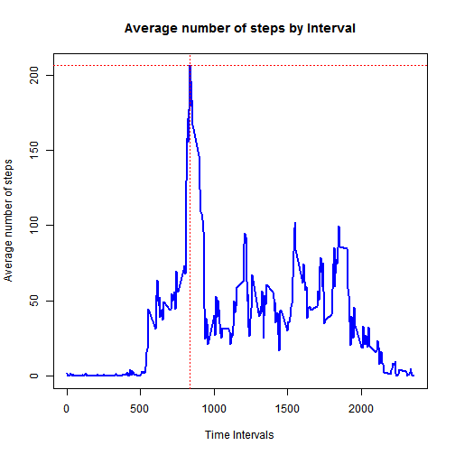
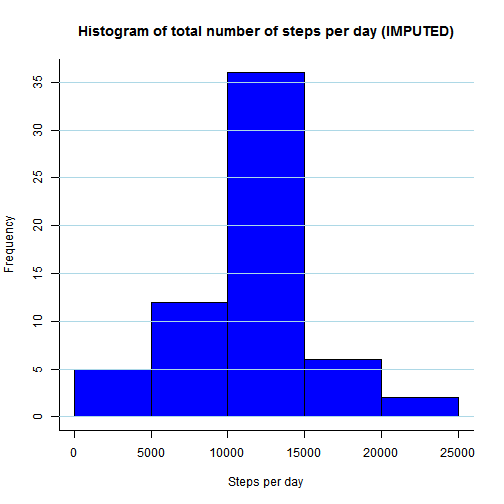
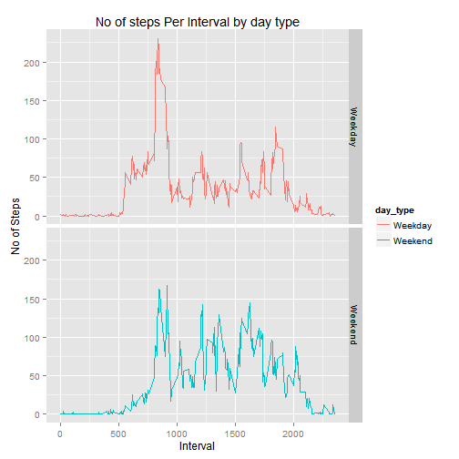

***Question:  Loading and preprocessing the data***

1. Load the data (i.e. read.csv())

2. Process/transform the data (if necessary) into a format suitable for your analysis

**Answer**

*Code*

```r
#############################################################################################################
##Author:       Dhrumil Dalal
##Date:         11/10/2015
##Description:  This function is responsible for loading the data. It checks for the existence of the folder
##              If the folder is not present. It will download the ziped file and unzip it. 
#############################################################################################################
GetDataSet <- function()
{
  setwd(".");
  
  if(!file.exists("./repdata-data-activity"))
  {
    
    dir.create("./repdata-data-activity")
    
    downloadURL <- "https://d396qusza40orc.cloudfront.net/repdata%2Fdata%2Factivity.zip"
    download.file(url = downloadURL ,destfile = "./Data.zip")
    unzip(zipfile = "./Data.zip",exdir = "./repdata-data-activity")
    
  }

  data.set = read.table(file = "./repdata-data-activity/activity.csv",header=T, quote="\"", sep=",")
  
  return(data.set)
}
#############################################################################################################

#############################################################################################################
##Author:       Dhrumil Dalal
##Date:         11/10/2015
##Description:  This function is responsible for removing the blank values from the dataset
#############################################################################################################
GetDataSetWithoutBlankValues <- function()
{
  ##Obtain Raw Data
  mydata <- GetDataSet()
  
  ##Eliminate the null values
  good_act <- mydata[complete.cases(mydata), ]
  
  return(good_act)
}
#############################################################################################################
```

-------------------------------------------------------------------------------------------------------------
-------------------------------------------------------------------------------------------------------------

***Question:  What is mean total number of steps taken per day?***

1. Calculate the total number of steps taken per day

2. Make a histogram of the total number of steps taken each day

3. Calculate and report the mean and median of the total number of steps taken per day

**Answer**

*Code*

```r
#############################################################################################################
##Author:       Dhrumil Dalal
##Date:         11/10/2015
##Description:  This function is responsible for plotting the histogram. Calculates Mean and Median
#############################################################################################################
ResponseForQuestion1 <- function()
{
  
  good_act <- GetDataSetWithoutBlankValues()
  steps_per_day <- aggregate(steps ~ date, good_act, sum)
  hist(steps_per_day$steps, col="blue", border="black", 
       main = "Histogram of total number of steps per day", 
       xlab = "Steps per day")
  box(bty="l")
  
  grid(nx=NA,ny=NULL,lty=1,lwd=1,col="lightblue")
  
  ##Compute Mean
  print(round(mean(steps_per_day$steps)))
  
  
  ##Compute Median
  print(median(steps_per_day$steps))
}
#############################################################################################################
```

*Output*

 

```
## [1] Mean is:  10766
## [1] Median is:  10765
```

-------------------------------------------------------------------------------------------------------------
-------------------------------------------------------------------------------------------------------------

***Question:  What is the average daily activity pattern?***

1. Make a time series plot (i.e. type = "l") of the 5-minute interval (x-axis) and the average number of steps taken, averaged across all days (y-axis)

2. Which 5-minute interval, on average across all the days in the dataset, contains the maximum number of steps?


**Answer**

*Code*

```r
#############################################################################################################
##Author:       Dhrumil Dalal
##Date:         11/10/2015
##Description:  This function is responsible for plotting the line graph for average number of steps taken in
##              a day in a 5 minutes time interval.  
#############################################################################################################
ResponseForQuestion2 <- function()
{
  good_act <- GetDataSetWithoutBlankValues();
  
  #Calculate average steps per interval for all days 
  avg_steps_per_interval <- aggregate(steps ~ interval, good_act, mean)

  # Identify the interval index which has the highest average steps
  interval_idx <- which.max(avg_steps_per_interval$steps)
  
  
  MaximumSteps  <- round(avg_steps_per_interval[interval_idx, ]$steps, digits = 1)
  TimeInterval <- avg_steps_per_interval[interval_idx, ]$interval  
    
  
  # Plot the time series with appropriate labels and heading
 
 
   plot(avg_steps_per_interval$interval, avg_steps_per_interval$steps, type='l', col="blue",
        ylim=c(0,MaximumSteps), 
       main="Average number of steps by Interval", xlab="Time Intervals", ylab="Average number of steps", 
       lwd=2)

   abline(v=TimeInterval, lty=3, col="red" ,lwd="1")    # Add vertical dotted line
   abline(h=MaximumSteps, lty=3,col="red" ,lwd="1")    # Add vertical dotted line  

  
  
  
  # Identify the specific interval and the average steps for that interval
  print ("As indicated by the drawb AB-lines",quote = FALSE)
  print(paste("The interval with the highest avg steps is ", TimeInterval),quote = FALSE) 
  print(paste("The number of steps for that interval is ", MaximumSteps),quote = FALSE)
  
  
  
}
#############################################################################################################
```


*Output*

 

```
## [1] As indicated by the drawb AB-lines
## [1] The interval with the highest avg steps is  835
## [1] The number of steps for that interval is  206.2
```

-------------------------------------------------------------------------------------------------------------
-------------------------------------------------------------------------------------------------------------

***Question:  Imputing missing values***

Note that there are a number of days/intervals where there are missing values (coded as NA). The presence of missing days may introduce bias into some calculations or summaries of the data.

1.Calculate and report the total number of missing values in the dataset (i.e. the total number of rows with NAs)


2.Devise a strategy for filling in all of the missing values in the dataset. The strategy does not need to be sophisticated. For example, you could use the mean/median for that day, or the mean for that 5-minute interval, etc.


3.Create a new dataset that is equal to the original dataset but with the missing data filled in.


4.Make a histogram of the total number of steps taken each day and Calculate and report the mean and median total number of steps taken per day. Do these values differ from the estimates from the first part of the assignment? What is the impact of imputing missing data on the estimates of the total daily number of steps?


**Answer**

*Code*

```r
#############################################################################################################
##Author:       Dhrumil Dalal
##Date:         11/10/2015
##Description:  This function is responsible for loading the data. It checks for the existence of the folder
##              If the folder is not present. It will download the ziped file and unzip it. 
#############################################################################################################
GetDataSet <- function()
{
  setwd(".");
  
  if(!file.exists("./repdata-data-activity"))
  {
    
    dir.create("./repdata-data-activity")
    
    downloadURL <- "https://d396qusza40orc.cloudfront.net/repdata%2Fdata%2Factivity.zip"
    download.file(url = downloadURL ,destfile = "./Data.zip")
    unzip(zipfile = "./Data.zip",exdir = "./repdata-data-activity")
    
  }

  data.set = read.table(file = "./repdata-data-activity/activity.csv",header=T, quote="\"", sep=",")
  
}
#############################################################################################################

#############################################################################################################
##Author:       Dhrumil Dalal
##Date:         11/11/2015
##Description:  This function is responsible for imputing the missing values  and plotting the line graph for 
##              average number of steps taken in  a day in a 5 minutes time interval.  
#############################################################################################################
ResponseForQuestion3 <- function()
{

  mydata <- GetDataSet()
  # Calculate the number of rows with missing values
  missing_value_act <- mydata[!complete.cases(mydata), ]
  
  
  #Calculate average steps per interval for all days 
  AvgStepsInterval <- aggregate(steps ~ interval, mydata, mean)  
  
  # In this scenario the missing values are replaced by  average value taken in last 5 mins interval.
  for (rownum in 1:nrow(mydata)) 
  {
    if(is.na(mydata$steps[rownum])) 
    {
      Substitute <- AvgStepsInterval$steps[which(AvgStepsInterval$interval == mydata$interval[rownum])]
      mydata$steps[rownum] <- Substitute 
    }
  }  
  
  # Aggregate the steps per day with the imputed values
  ImputedStepsPerDay <- aggregate(steps ~ date, mydata, sum)
  
  # Draw a histogram of the value 
  hist(ImputedStepsPerDay$steps, col="blue",border="black",
       main = "Histogram of total number of steps per day (IMPUTED)", 
       xlab = "Steps per day")
  box(bty="l")
  
  grid(nx=NA,ny=NULL,lty=1,lwd=1,col="lightblue")  
  
  
  print(paste("Total Missing Values are ", nrow(missing_value_act)),quote=FALSE)
  
  print(paste('Imputed Mean is: ', round(mean(ImputedStepsPerDay$steps,2))),quote = FALSE)
  
  print(paste('Imputed Median is: ', round(median(ImputedStepsPerDay$steps,2))),quote = FALSE)
    
}
#############################################################################################################
```

*Output*

 

```
## [1] Total Missing Values are  2304
## [1] Imputed Mean is:  10766
## [1] Imputed Median is:  10766
```

*Conclusion*

There is slight change in the Mean. However there is no change in the Median.

-------------------------------------------------------------------------------------------------------------
-------------------------------------------------------------------------------------------------------------

***Question:  Are there differences in activity patterns between weekdays and weekends?***

For this part the weekdays() function may be of some help here. Use the dataset with the filled-in missing values for this part.

1.Create a new factor variable in the dataset with two levels – “weekday” and “weekend” indicating whether a given date is a weekday or weekend day.


2.Make a panel plot containing a time series plot (i.e. type = “l”) of the 5-minute interval (x-axis) and the average number of steps taken, averaged across all weekday days or weekend days (y-axis). See the README file in the GitHub repository to see an example of what this plot should look like using simulated data.

**Answer**

*Code*


```r
#############################################################################################################
##Author:       Dhrumil Dalal
##Date:         11/11/2015
##Description:  This function is responsible for plotting the line graph for average number of steps taken in
##              a day in a 5 minutes time interval.  
#############################################################################################################
IsweekDay <- function(date_val) 
{
  day <- weekdays(as.Date(date_val, '%Y-%m-%d'))
  if  (!(day == 'Saturday' || day == 'Sunday')) 
  {
    dayofweek <- 'Weekday'
  } 
  else 
  {
    dayofweek <- 'Weekend'
  }
  dayofweek
}
#############################################################################################################

#############################################################################################################
##Author:       Dhrumil Dalal
##Date:         11/13/2015
##Description:  This function is responsible for plotting the graph Weekdays and Weekends
#############################################################################################################
ResponseForQuestion4 <- function()
{
  
  mydata <- GetDataSet()
  # Calculate the number of rows with missing values
  missing_value_act <- mydata[!complete.cases(mydata), ]
  
  #Calculate average steps per interval for all days 
  AvgStepsInterval <- aggregate(steps ~ interval, mydata, mean)  
  
  for (rownum in 1:nrow(mydata)) 
  {
    if(is.na(mydata$steps[rownum])) 
    {
      Substitute <- AvgStepsInterval$steps[which(AvgStepsInterval$interval == mydata$interval[rownum])]
      mydata$steps[rownum] <- Substitute 
    }
  }  
  

  mydata$day_type <- as.factor(sapply(mydata$date, IsweekDay))
  
  
  #load the ggplot library
  library(ggplot2)
  
  # Create the aggregated data frame by intervals and day_type
  ImputedStepsPerDay <- aggregate(steps ~ interval+day_type, mydata, mean)
  
  # Create the plot
  plt <- ggplot(ImputedStepsPerDay, aes(interval, steps)) +
    geom_line(stat = "identity", aes(colour = day_type)) +
    theme_gray() +
    facet_grid(day_type ~ ., scales="fixed", space="fixed") +
    labs(x="Interval", y=expression("No of Steps")) +
    ggtitle("No of steps Per Interval by day type")
  print(plt)  
  
}
#############################################################################################################
```

*Output*

 

*Conclusion*

1. The daily activity starts bit late in the day during the weekend as compared to the weekdays.
2. The peak for number of steps taken during the weekdays is greater than the number of steps taken dueing weekends.
3. During the weekday the number of steps taken increase between internval (1000-2000) in bursts. However during the weekends there is consistent activity between the internval(1000-2000) 
4. There is consistent activity that is being done over the weekends as compared to weekdays.

-------------------------------------------------------------------------------------------------------------
-------------------------------------------------------------------------------------------------------------
